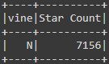
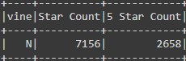
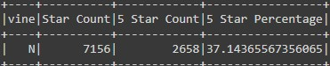

# Amazon_Vine_Analysis

# Overview of the analysis
The purpose of this project is to apply ETL process for big data using sparks and google colab. For this objective we use amazon review data for us Digital Music Purchase V1.00, hosted at: https://s3.amazonaws.com/amazon-reviews-pds/tsv/amazon_reviews_us_Digital_Music_Purchase_v1_00.tsv.gz.

# Results
After extracting the data for aws and loading into a spark data frame we can transform the data to answer the following questions:

•	How many Vine reviews and non-Vine reviews were there?
The dataset I selected for this challenge had 0 Vine reviews and 7156 non-Vine reviews. The total of review is after dropping reviews with less than 20 votes. 

•	How many Vine reviews were 5 stars? How many non-Vine reviews were 5 stars?
As mentioned in the previous question the data set contain no Vine reviews, therefore were no Vine 5 stars reviews, but there were 2658 non-Vine 5 stars reviews.

•	What percentage of Vine reviews were 5 stars? What percentage of non-Vine reviews were 5 stars?
The percentage of 5 stars Vine reviews is 0% since there were no Vine reviews. As non-Vine reviews, the percentage of 5 stars reviews was 37.14%.

# Summary
Unfortunately, we won’t be able to answer the question if there is any positivity bias in the Vine review program, since our data set did not contain any Vine reviews, but parting that the non-Vine reviews were 37.14% five stars, and data set is for digital music sale, it might not beneficial or needed to use the Vine program in this category. To support null hypothesis, we could find the percentage of 1 thru 4 starts reviews and determine if reviews for purchases of digital music tend to be positive, since purchaser are already familiar with the artist and his work.
